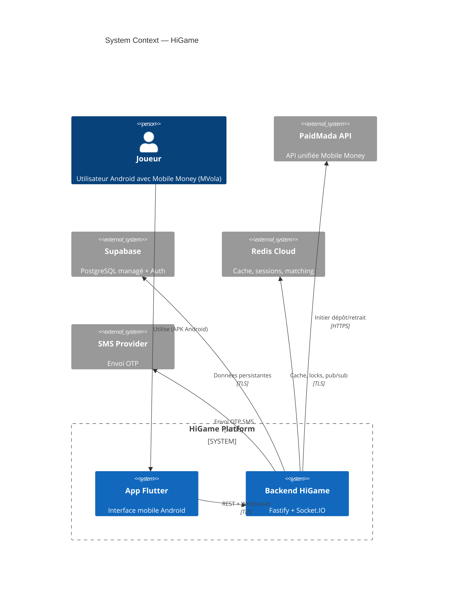
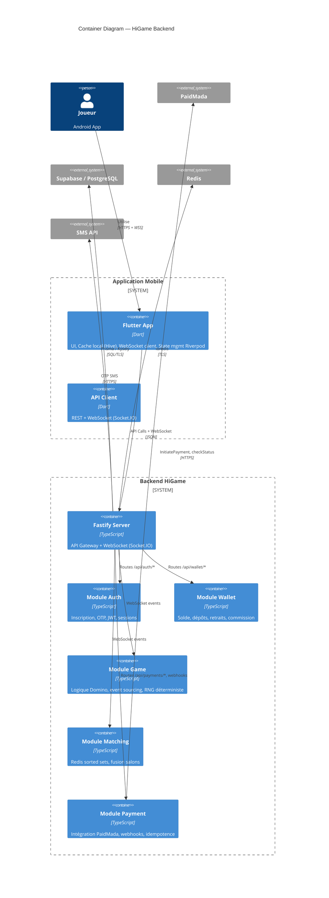
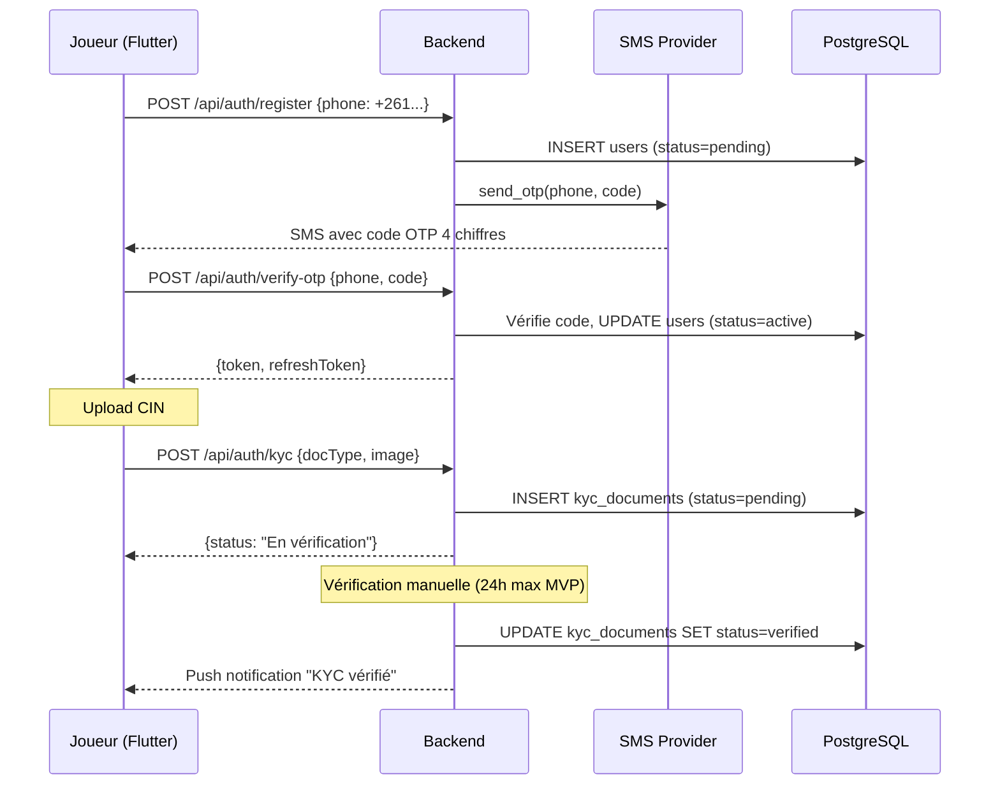
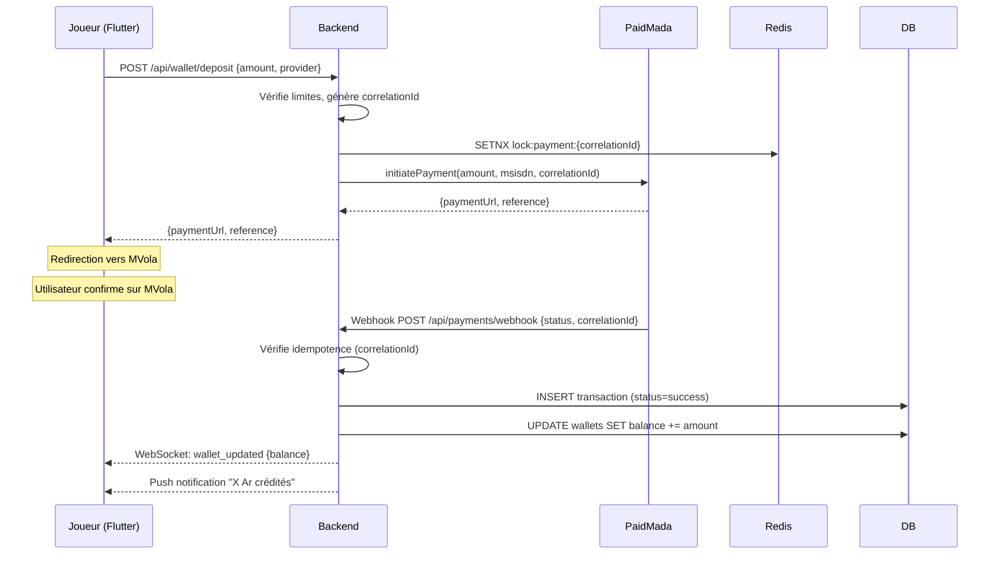
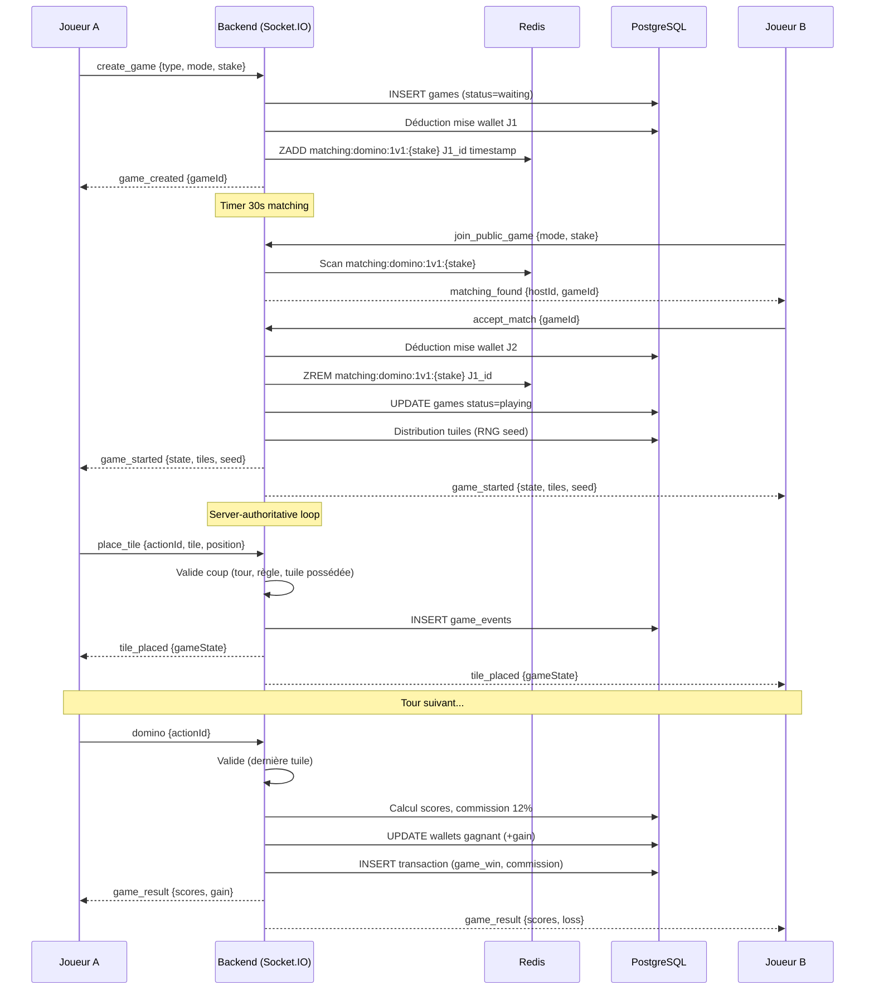
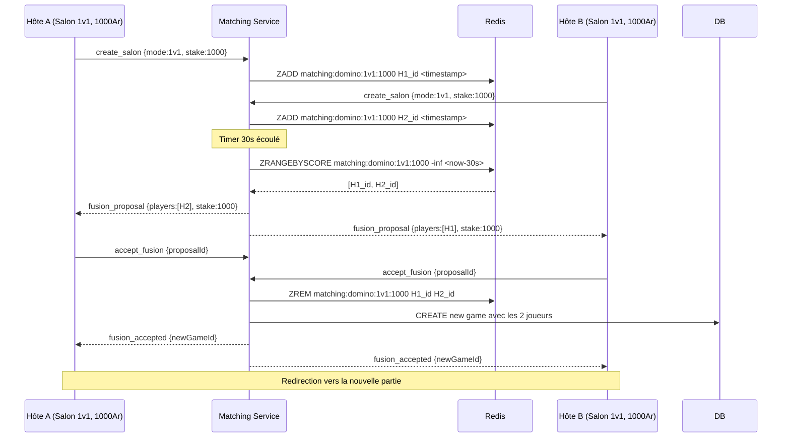
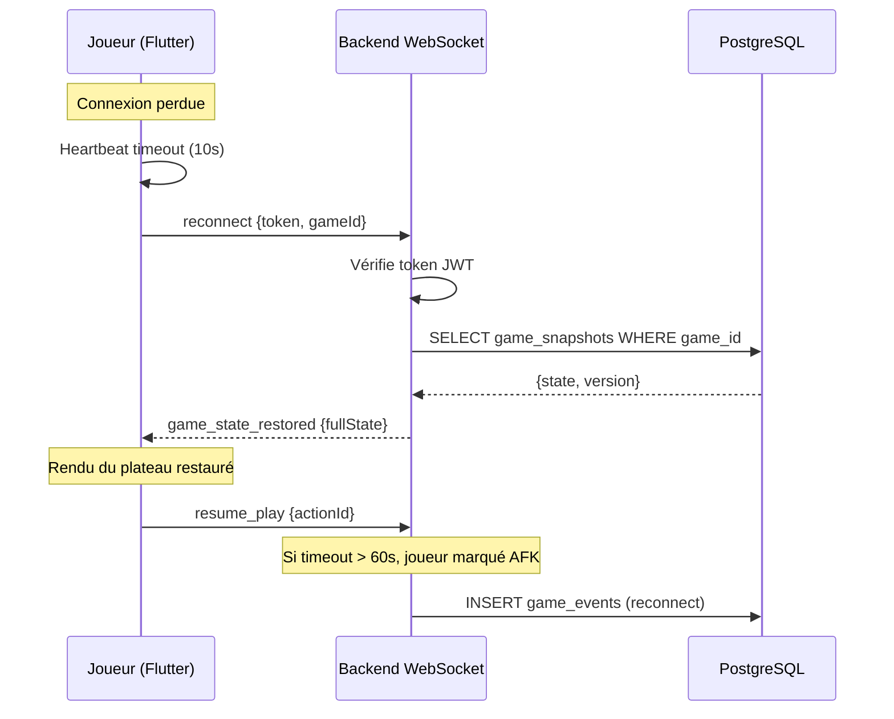
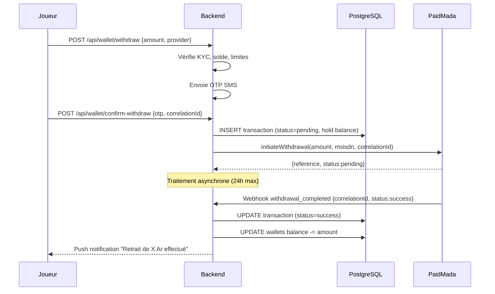

# HiGame — Architecture Technique

**Date :** 2026-05-09
**Auteur :** John (Architecte)
**Version :** 1.0
**Statut :** Draft

---

## Table des Matières

1. Objectif et Portée
2. Diagramme C4 — Contexte
3. Diagramme C4 — Conteneurs
4. Diagramme C4 — Déploiement
5. Schéma de Base de Données
6. Structure du Projet (Monorepo)
7. Flux Détaillés
8. Décisions d'Architecture (ADR)
9. Sécurité
10. Anti-Triche
11. CI/CD et Déploiement MVP
12. Glossaire

---

## 1. Objectif et Portée

### 1.1 Objectif

Ce document décrit l'architecture technique de HiGame, une plateforme mobile de jeux traditionnels malgaches avec paris en argent réel. Il sert de référence pour l'implémentation du MVP (Domino multijoueur, Android APK, bêta fermée 500 testeurs).

### 1.2 Portée MVP

| Élément | Inclus MVP | V2+ |
|---------|:----------:|:---:|
| Domino 1v1 | ✅ | — |
| Domino 4 joueurs (équipes) | ✅ | — |
| Ludo | ❌ | ✅ |
| Jeux de cartes | ❌ | ✅ |
| Inscription téléphone + OTP | ✅ | — |
| KYC (upload CIN) | ✅ | — |
| Wallet + dépôt MVola | ✅ | — |
| Retrait Mobile Money | ✅ (manuel) | Automatique |
| Salons privés | ✅ | — |
| Fusion de salons (matching) | ✅ | — |
| Anti-triche server-authoritative | ✅ | ML V2 |
| Event sourcing / logs replay | ✅ | — |
| Orange Money / Airtel Money | ❌ | ✅ |
| Terrains virtuels | ❌ | ✅ |
| Tournois | ❌ | ✅ |

---

## 2. Diagramme C4 — Contexte



---

## 3. Diagramme C4 — Conteneurs



---

## 4. Diagramme C4 — Déploiement

```mermaid
C4Deployment
  title Deployment Diagram — HiGame MVP

  Deployment_Node(vps, "VPS OVH / DigitalOcean", "Ubuntu 22.04, 4GB RAM, 2 CPU") {
    Deployment_Node(docker, "Docker Compose") {
      Container(be, "Backend", "Node.js / Fastify", "Port 3000")
      Container(redis, "Redis", "redis:7", "Port 6379")
    }
  }

  Deployment_Node(supabase_infra, "Supabase Cloud") {
    Container(db, "PostgreSQL 15", "Données persistantes", "Port 5432")
  }

  Deployment_Node(github, "GitHub Actions + Codemagic") {
    Container(ci, "CI/CD Pipeline", "Build, test, sign APK")
  }

  Deployment_Node(paidmada_infra, "PaidMada") {
    Container(pm_api, "PaidMada API", "Initiation + webhooks")
  }

  Rel(be, db, "Requêtes SQL", "TLS/5432")
  Rel(be, redis, "Cache / Pub/Sub", "6379")
  Rel(ci, vps, "Deploy backend", "SSH")
  Rel(be, pm_api, "InitPayment / withdrawal", "HTTPS")
```

---

## 5. Schéma de Base de Données

```mermaid
erDiagram
    users {
        uuid id PK
        string phone "unique, format +261..."
        string nickname
        string avatar_url
        string kyc_status "pending | verified | rejected"
        jsonb kyc_doc_url "chiffré AES-256"
        string password_hash
        boolean is_active
        jsonb limits "limites de dépôt"
        timestamp created_at
    }

    sessions {
        uuid id PK
        uuid user_id FK
        string token_hash
        jsonb device_info
        timestamp created_at
        timestamp expires_at
    }

    wallets {
        uuid id PK
        uuid user_id FK "unique"
        integer balance "en Ariary, centimes"
        integer version "optimistic lock"
        timestamp created_at
        timestamp updated_at
    }

    transactions {
        uuid id PK
        uuid user_id FK
        string type "deposit | withdrawal | game_buy_in | game_win | commission | refund"
        integer amount "en Ariary"
        string currency "Ar"
        string status "pending | success | failed | refunded"
        uuid correlation_id "unique, idempotence"
        string provider_ref "référence PaidMada"
        jsonb metadata "infos supplémentaires"
        timestamp created_at
    }

    kyc_documents {
        uuid id PK
        uuid user_id FK
        string doc_type "cin | permis"
        string file_path "chiffré"
        string status "pending | verified | rejected"
        string rejection_reason
        timestamp verified_at
        timestamp created_at
    }

    games {
        uuid id PK
        string type "domino"
        string mode "1v1 | 4p"
        integer stake "mise en Ar"
        string status "waiting | playing | finished | cancelled"
        integer commission_rate "12"
        integer target_score "100"
        string rng_seed "seed déterministe"
        uuid winner_id FK
        integer total_pool
        timestamp started_at
        timestamp finished_at
        timestamp created_at
    }

    game_players {
        uuid id PK
        uuid game_id FK
        uuid user_id FK
        integer team "1 ou 2"
        integer seat_number "1-4"
        string status "joined | playing | afk | abandoned"
        integer final_score
        timestamp joined_at
    }

    game_events {
        bigint id PK "auto-increment"
        uuid game_id FK
        string event_type "tile_placed | tile_drawn | passed | domino | block | score | reconnect"
        uuid player_id FK
        jsonb payload "détail de l'action"
        timestamp created_at
    }

    game_snapshots {
        uuid game_id PK
        jsonb state "état complet du plateau"
        integer version
        timestamp created_at
    }

    idempotency_keys {
        string key PK "correlationId"
        string response "résultat mis en cache"
        timestamp expires_at "TTL 24h"
    }

    users ||--o{ sessions : "a"
    users ||--o| wallets : "possède"
    users ||--o{ transactions : "effectue"
    users ||--o{ kyc_documents : "soumet"
    users ||--o{ game_players : "participe"
    games ||--o{ game_players : "contient"
    games ||--o{ game_events : "logs"
    games ||--o| game_snapshots : "snapshot"
```



### 5.1 Index critiques PostgreSQL

```sql
CREATE UNIQUE INDEX idx_users_phone ON users(phone);
CREATE INDEX idx_transactions_user_id ON transactions(user_id);
CREATE INDEX idx_transactions_correlation ON transactions(correlation_id);
CREATE INDEX idx_transactions_status ON transactions(status);
CREATE INDEX idx_games_status ON games(status);
CREATE INDEX idx_game_events_game ON game_events(game_id);
CREATE INDEX idx_game_events_created ON game_events(created_at);
CREATE INDEX idx_game_players_game ON game_players(game_id);
CREATE INDEX idx_sessions_expires ON sessions(expires_at) WHERE expires_at < NOW();
CREATE UNIQUE INDEX idx_idempotency_key ON idempotency_keys(key);
```

### 5.2 Redis structures

```redis
# Sessions WebSocket
SET ws:session:{userId} "{socketId, gameId, status, joinedAt}" EX 3600

# Matching queues (sorted sets par timestamp)
ZADD matching:domino:1v1:{stake} {hostId} {timestamp}
ZADD matching:domino:4p:{stake} {hostId} {timestamp}

# Idempotence locks
SET lock:payment:{correlationId} "processing" NX EX 120

# Wallet operation locks
SET lock:wallet:{userId} "locked" NX EX 5

# Active game rooms
SADD game:room:{gameId} {userId1} {userId2} {userId3} {userId4}

# Rate limiting
INCR rate:otp:{phone} → EX 300  # 3 max / 5min
INCR rate:deposit:{userId} → EX 86400  # limite journalière
```

---

## 6. Structure du Projet (Monorepo)

```
higame/
├── .github/
│   └── workflows/
│       ├── ci.yml              # Tests + lint backend
│       └── build-apk.yml       # Build APK via Codemagic
├── packages/
│   ├── frontend/               # Flutter (Riverpod + go_router)
│   │   ├── lib/
│   │   │   ├── core/
│   │   │   │   ├── theme/        # Couleurs, typographie (bleu #1A237E)
│   │   │   │   ├── network/      # API client, WebSocket service
│   │   │   │   ├── routing/      # go_router déclaratif
│   │   │   │   └── storage/      # Hive cache local
│   │   │   ├── features/
│   │   │   │   ├── auth/         # Onboarding, OTP, KYC
│   │   │   │   │   ├── screens/
│   │   │   │   │   ├── providers/
│   │   │   │   │   └── models/
│   │   │   │   ├── wallet/       # Solde, dépôt, retrait, historique
│   │   │   │   ├── lobby/        # Dashboard, créer/rejoindre partie
│   │   │   │   ├── matching/     # Salon d'attente, fusion popup
│   │   │   │   ├── game/         # Plateau Domino (moteur rendu)
│   │   │   │   │   ├── screens/  # Plateau, résultat
│   │   │   │   │   ├── providers/ # GameProvider (Riverpod)
│   │   │   │   │   ├── widgets/  # Tuile, chaîne, main, timer
│   │   │   │   │   └── models/   # Tile, GameState, Player
│   │   │   │   ├── profile/      # Profil, historique, paramètres
│   │   │   │   └── rules/        # Règles du Domino
│   │   │   ├── shared/
│   │   │   │   └── widgets/      # Boutons, avatars, loaders, etc.
│   │   │   ├── app.dart
│   │   │   └── main.dart
│   │   ├── test/
│   │   └── pubspec.yaml
│   └── backend/                 # Fastify + Socket.IO + TypeScript
│       ├── src/
│       │   ├── modules/
│       │   │   ├── auth/
│       │   │   │   ├── auth.routes.ts
│       │   │   │   ├── auth.controller.ts
│       │   │   │   ├── auth.service.ts
│       │   │   │   └── auth.schema.ts
│       │   │   ├── wallet/
│       │   │   │   ├── wallet.routes.ts
│       │   │   │   ├── wallet.controller.ts
│       │   │   │   ├── wallet.service.ts
│       │   │   │   └── wallet.schema.ts
│       │   │   ├── game/
│       │   │   │   ├── game.gateway.ts      # WebSocket events
│       │   │   │   ├── game.service.ts      # Logique Domino
│       │   │   │   ├── game.rng.ts          # RNG déterministe
│       │   │   │   ├── game.replay.ts       # Event sourcing / replay
│       │   │   │   └── domino-engine.ts     # Moteur règles Domino
│       │   │   ├── matching/
│       │   │   │   ├── matching.service.ts  # Redis sorted sets
│       │   │   │   └── matching.gateway.ts  # Popup fusion WS
│       │   │   └── payment/
│       │   │       ├── payment.service.ts   # PaidMada client
│       │   │       ├── payment.webhook.ts   # Gestion webhooks
│       │   │       └── payment.cron.ts      # Check pending transactions
│       │   ├── shared/
│       │   │   ├── db/
│       │   │   │   ├── client.ts            # Prisma / Kysely instance
│       │   │   │   └── migrations/
│       │   │   ├── redis/
│       │   │   │   └── client.ts            # ioredis instance
│       │   │   ├── ws/
│       │   │   │   └── gateway.ts           # Socket.IO setup
│       │   │   ├── middleware/
│       │   │   │   ├── auth.middleware.ts    # JWT verification
│       │   │   │   ├── rate-limit.ts
│       │   │   │   └── idempotency.ts
│       │   │   └── types/
│       │   │       └── index.ts
│       │   ├── config/
│       │   │   └── index.ts                 # Env vars, constants
│       │   └── app.ts                       # Fastify entrypoint
│       ├── test/
│       │   ├── unit/
│       │   └── integration/
│       ├── package.json
│       ├── tsconfig.json
│       └── Dockerfile
├── docker-compose.yml           # Backend + Redis
├── package.json                 # Workspaces racine
└── README.md
```

---

## 7. Flux Détaillés

### 7.1 Inscription → KYC



### 7.2 Dépôt MVola via PaidMada



### 7.3 Partie Domino (Création → Résultat)



### 7.4 Fusion de salons (Matching)



### 7.5 Reconnexion après coupure réseau



### 7.6 Retrait vers Mobile Money



---

## 8. Décisions d'Architecture (ADR)

### ADR-001 : Stack Frontend — Flutter + Riverpod + go_router

| Attribut | Valeur |
|----------|--------|
| **Contexte** | Application mobile Android avec WebSocket temps réel, cache offline, confiance utilisateur (argent réel) |
| **Décision** | Flutter (natif) plutôt que PWA ou React Native |
| **Justification** | Performances natives, WebSocket natif robuste, paquet mvola-dart existant, un seul codebase pour Android/iOS/Web plus tard |
| **Conséquences** | Flutter APK (~15-25MB), apprentissage Dart nécessaire pour l'équipe |
| **State mgmt** | Riverpod — moderne, testable, moins de boilerplate que BLoC |
| **Routing** | go_router — déclaratif, redirections auth, deep linking |

### ADR-002 : Stack Backend — Fastify + Socket.IO + TypeScript

| Attribut | Valeur |
|----------|--------|
| **Contexte** | Serveur temps réel pour jeu multijoueur, API REST pour wallet/profil, event sourcing |
| **Décision** | Fastify plutôt qu'Express ou NestJS |
| **Justification** | 2x plus performant qu'Express, typage natif TS, module WebSocket @fastify/websocket + Socket.IO pour les rooms/reconnect |
| **Conséquences** | Écosystème plus petit qu'Express, mais suffisant pour le MVP |
| **Socket.IO** | Rooms pour broadcast par partie, reconnexion auto, fallback HTTP polling si réseau instable |

### ADR-003 : Architecture — Monolithe modulaire

| Attribut | Valeur |
|----------|--------|
| **Contexte** | Équipe réduite (1-2 devs), MVP à livrer vite, mais besoin de scaler plus tard |
| **Décision** | Un seul projet Node.js avec modules séparés (auth, wallet, game, matching, payment) |
| **Justification** | Simplicité de déploiement, pas de overhead réseau entre services, facile à refactoriser en microservices si besoin |
| **Conséquences** | Si scale > 1000 connexions simultanées, découpage possible (game-service autonome) |

### ADR-004 : Base de données — Supabase (PostgreSQL) + Redis

| Attribut | Valeur |
|----------|--------|
| **Contexte** | Données ACID (wallet), requêtes complexes, cache temps réel, files d'attente |
| **Décision** | PostgreSQL (Supabase managé) pour données persistantes, Redis (Cloud ou VPS) pour temps réel |
| **Justification** | Supabase = PostgreSQL managé + auth intégrée + backup auto. Redis = sorted sets pour matching, locks, pub/sub |
| **Conséquences** | Dépendance Supabase (~25$/mois). Redis Cloud: plan gratuit 30MB suffisant pour MVP |

### ADR-005 : Server-Authoritative (Anti-Triche)

| Attribut | Valeur |
|----------|--------|
| **Contexte** | Jeu avec argent réel — aucune confiance dans le client |
| **Décision** | 100% logique de jeu côté serveur. Client = terminal d'affichage + envoi d'intentions |
| **Justification** | Impossible de tricher si le client ne peut pas modifier l'état du jeu. Toute action validée côté serveur |
| **Implémentation** | Client envoie `{actionId, action, payload}` → serveur valide → broadcast nouvel état |
| **RNG** | Seed `hash(gameId + createdAt)`, stocké dans `games.rng_seed` |
| **Replay** | Table `game_events` permet reconstruction intégrale, vérifiable post-partie |

### ADR-006 : Event Sourcing pour les parties

| Attribut | Valeur |
|----------|--------|
| **Contexte** | Traçabilité complète, résolution de litiges, log de replay |
| **Décision** | Chaque action de jeu = événement dans `game_events`. Snapshot périodique dans `game_snapshots` pour reconnexion rapide |
| **Justification** | Audit complet, possibilité de rejouer n'importe quelle partie, debug facilité |
| **Conséquences** | Stockage événementiel (prévoir cleanup ou partitionnement après 50k+ parties) |

### ADR-007 : Paiements — PaidMada

| Attribut | Valeur |
|----------|--------|
| **Contexte** | Intégration MVola (prioritaire), puis OM et Airtel. Transactions asynchrones |
| **Décision** | PaidMada comme API unifiée Mobile Money |
| **Justification** | API unique pour 3 providers, SDK TypeScript, mode mock pour développement, webhooks intégrés |
| **Idempotence** | `correlationId` unique par opération. Redis lock + table `idempotency_keys` |
| **Timeouts** | Polling 5s × 10 max (50s), puis marquer échoué. CRON pour les pending > 2h |

### ADR-008 : Commission 12%

| Attribut | Valeur |
|----------|--------|
| **Contexte** | Commission prélevée sur le gagnant |
| **Décision** | Mise déduite du wallet à la création/rejoindre. Pool total calculé. Commission déduite du gain |
| **Formule** | Gain = Pool × (1 - 12%). Ex: 2000×2 = 4000 - 12% = 3520 Ar pour le gagnant |
| **Traçabilité** | Transaction séparée pour la commission (même table `transactions`, type=commission) |

### ADR-009 : Matching via Redis Sorted Sets

| Attribut | Valeur |
|----------|--------|
| **Contexte** | Appairage des joueurs de même jeu/mise/mode, avec timeout 30s et fusion de salons |
| **Décision** | Sorted sets Redis avec clé composite `matching:{game}:{mode}:{stake}`, score = timestamp |
| **Justification** | O(log N) pour insert/scan, scan toutes les 5s, popup simultanée via Socket.IO rooms |
| **Fusion** | Si 2+ hôtes solo avec mêmes critères → popup → si tous acceptent → nouveau game_id commun |

---

## 9. Sécurité

### 9.1 Authentification et Sessions

| Mesure | Implémentation |
|--------|---------------|
| **Inscription** | OTP SMS 4 chiffres, 3 tentatives max, blocage 15 min |
| **JWT Access** | 15 min, signé HMAC-SHA256, stocké en Secure Storage Flutter |
| **JWT Refresh** | 7 jours, stocké sécurisé, possibilité de révoquer toutes les sessions |
| **Sessions** | Table `sessions` avec `token_hash` pour audit et révocation |
| **Rate limiting** | OTP: 3/5min, Dépôt: limites configurable, API: 100/min par IP |

### 9.2 Wallet et Transactions

| Mesure | Implémentation |
|--------|---------------|
| **Solde** | Optimistic locking via `version` dans `wallets` |
| **Transactions** | Atomicité SQL : tout commit ou tout rollback |
| **Double dépense** | Redis lock NX EX 5s + `correlationId` unique |
| **Audit trail** | Toute mutation de wallet = ligne dans `transactions` |
| **Hot wallet** | Pas de hot wallet centralisé. Compte MVola marchand dédié |
| **Virements MVP** | Manuel (bêta fermée) — l'admin initie le transfert MVola |

### 9.3 Chiffrement et Données

| Donnée | Chiffrement |
|--------|-------------|
| **Documents KYC (CIN)** | AES-256 avant stockage. Clé en env var |
| **Mots de passe** | bcrypt (cost 12) |
| **Tokens JWT** | HMAC-SHA256 |
| **Toutes les communications** | TLS 1.3 |
| **Numéros de téléphone** | Base de données en TLS, pas de logs en clair |

### 9.4 KYC et Conformité

| Exigence | MVP |
|----------|:----:|
| **KYC obligatoire** | Upload CIN ou permis, statut "En vérification" |
| **Âge minimum** | Blocage < 18 ans |
| **Limites de dépôt** | Configurable par le joueur |
| **Auto-exclusion** | 24h, 7j, 30j |
| **Données personnelles** | Rétention 3 ans après dernier login, suppression possible |
| **Consentement** | Checkbox CGU obligatoire à l'inscription |

---

## 10. Anti-Triche

### 10.1 Server-Authoritative

Le serveur détient la vérité absolue. Le client Flutter n'est qu'un terminal :

| Action client | Traitement serveur |
|--------------|-------------------|
| `place_tile {tile, position}` | Vérifie : c'est ton tour, tu possèdes cette tuile, la position est légale (chiffre correspondant), la tuile n'a pas déjà été jouée |
| `draw` | Vérifie : c'est ton tour, tu ne peux pas poser de tuile, il reste des tuiles dans la réserve |
| `pass` | Vérifie : c'est ton tour, tu ne peux pas poser, la réserve est vide |
| `domino` | Vérifie : il te reste exactement 1 tuile, c'est ton tour, tu la poses sur une extrémité valide |

### 10.2 RNG Déterministe

```typescript
// Seed = hash unique de la partie
const seed = crypto.createHash('sha256')
  .update(gameId + gameCreatedAt)
  .digest('hex');

// Pseudo-RNG basé sur le seed (algo XorShift128+ ou similaire)
// Déterministe : mêmes seed + mêmes appels → mêmes résultats
function shuffleTiles(seed: string, tiles: Tile[]): Tile[] {
  const rng = createSeededRng(seed);
  return fisherYatesShuffle(tiles, rng);
}
```

### 10.3 Logs de Replay

Chaque événement `game_events` contient :

```json
{
  "id": 1,
  "game_id": "uuid",
  "event_type": "tile_placed",
  "player_id": "uuid",
  "payload": {
    "tile": { "left": 3, "right": 5 },
    "position": "left",
    "board_state_hash": "hash_of_resulting_state",
    "remaining_tiles": 5
  },
  "created_at": "2026-05-09T12:00:00Z"
}
```

- **Replay intégral** : Trier par `id` ASC, rejouer les événements dans l'ordre
- **Interface admin** : Step-through, export JSON, recherche par game/joueur/date
- **Résolution litiges** : Admin vérifie la partie pas-à-pas

### 10.4 Anti-Cheat Complémentaire (V2)

| Mécanisme | Description | Priorité |
|-----------|-------------|:--------:|
| Détection de bots ML | Random Forest + LSTM sur patterns de timing (~90% précision) | V2 |
| Anti-collusion | Analyse IP, clustering, patterns de jeu anormaux | V2 |
| Mental Poker Protocol | Engagements cryptographiques SHA-256 pour jeux de cartes | V3 |

---

## 11. CI/CD et Déploiement MVP

### 11.1 Infrastructure

| Composant | Solution | Coût estimé |
|-----------|----------|:-----------:|
| **Backend** | VPS OVH/DO (Ubuntu, 4GB RAM, 2 CPU) | ~15-20$/mois |
| **PostgreSQL** | Supabase (Pro plan) | ~25$/mois |
| **Redis** | Redis Cloud (30MB gratuit) ou même VPS | ~0-5$/mois |
| **CI/CD** | GitHub Actions (2000 min/mois gratuits) | Gratuit |
| **Build APK** | Codemagic (500 min/mois gratuits) | Gratuit |
| **Domaine** | .mg ou .com | ~10-20$/an |
| **Total estimé** | | **~45-50$/mois** |

### 11.2 Pipeline CI/CD

```yaml
# .github/workflows/ci.yml
name: CI
on: [push, pull_request]
jobs:
  lint-test:
    runs-on: ubuntu-latest
    steps:
      - uses: actions/checkout@v4
      - name: Install backend dependencies
        run: cd packages/backend && npm ci
      - name: Lint backend
        run: cd packages/backend && npm run lint
      - name: Test backend
        run: cd packages/backend && npm test
      - name: Build backend
        run: cd packages/backend && npm run build
```

```yaml
# .github/workflows/build-apk.yml
name: Build APK
on:
  push:
    tags: ["v*"]
jobs:
  build:
    runs-on: ubuntu-latest
    steps:
      - uses: actions/checkout@v4
      - name: Setup Flutter
        uses: subosito/flutter-action@v2
      - name: Build APK
        run: cd packages/frontend && flutter build apk --release
      - name: Upload APK
        uses: actions/upload-artifact@v4
        with:
          name: higame-release.apk
          path: packages/frontend/build/app/outputs/flutter-apk/app-release.apk
```

### 11.3 Docker Compose

```yaml
# docker-compose.yml
version: '3.8'
services:
  backend:
    build: ./packages/backend
    ports:
      - "3000:3000"
    env_file: .env.production
    depends_on:
      - redis
    restart: unless-stopped

  redis:
    image: redis:7-alpine
    ports:
      - "6379:6379"
    volumes:
      - redis_data:/data
    restart: unless-stopped

volumes:
  redis_data:
```

### 11.4 Stratégie de scaling

| Seuil | Action |
|:-----:|--------|
| **0-1000 connexions simultanées** | 1 VPS (4GB/2CPU) + Supabase + Redis Cloud |
| **1000-5000 connexions** | 2 instances backend derrière Nginx/HAProxy + Redis Cluster |
| **5000+ connexions** | Game service isolé sur instances dédiées + load balancer + PostgreSQL read replicas |

---

## 12. Glossaire

| Terme | Définition |
|-------|-----------|
| **Server-Authoritative** | Modèle où le serveur détient et valide toute la logique de jeu |
| **Event Sourcing** | Pattern où chaque action est stockée comme un événement immuable plutôt que l'état courant |
| **Optimistic Locking** | Mécanisme de verrouillage utilisant un compteur de version pour éviter les écritures concurrentes |
| **CorrelationId** | Identifiant unique de transaction pour idempotence (éviter les doublons) |
| **PaidMada** | API unifiée open-source pour MVola, Orange Money et Airtel Money |
| **RNG Déterministe** | Générateur aléatoire produisant toujours la même séquence à partir d'une seed donnée |
| **Socket.IO** | Librairie WebSocket avec fallback HTTP, rooms, et reconnexion automatique |
| **Fusion de salons** | Mécanisme combinant deux hôtes solo en attente pour créer une partie plus rapidement |
| **Snapshot** | Capture complète de l'état d'une partie à un instant donné (pour reconnexion rapide) |
| **KYC** | Know Your Customer — vérification d'identité obligatoire pour jeux d'argent |

---

*Document généré par John — Architecte (bmad-agent-architect)*
*Date : 09/05/2026*
*Sources : PRD HiGame MVP, Document Stratégique, Session Brainstorming BP-001*
